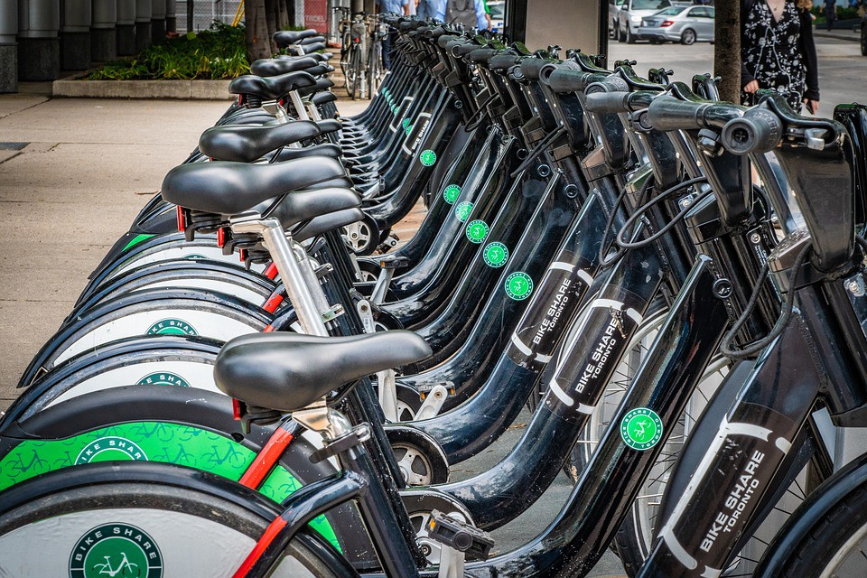
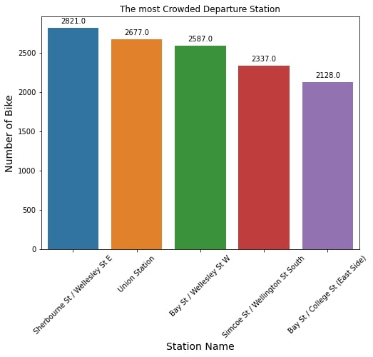
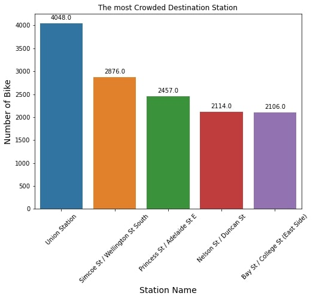

# Toronto-Bikeshare-Analysis

## Background
Bike Share Toronto is a bicycle-sharing system located in Toronto, Canada. Bike Share Toronto offers 24/7 convenient access to 6850 bikes and 625 stations across 200 km2 of the city. There are annual membership, single trip, 72 hours access and 24 hour access for customers who want to exploring Toronto city. It is the most flexible and cost-effective way to navigate Toronto.
## About the Datasets
The Bike Share Toronto Ridership data contains anonymized trip data, including:
- Trip start day and time
- Trip end day and time
- Trip duration
- Trip start station
- Trip end station
- User Type

In the datasets, we have the bike sharing information from 2017 and 2018. This datasets is from Toronto Parking Authority, published on https://open.toronto.ca/dataset/bike-share-toronto-ridership-data/. We may find the latest complete datasets from there. The data is licensed under: [Open Government License – Toronto](https://open.toronto.ca/open-data-license/). 

## Objective
We want to know if do we need a crew to pick up and restore all the bikes to initial distributions across the city before the next day? 

## Analysis
The analysis is limited to 2018, the newest from the datasets. 
First, we want to know how many bikes are returned immediately. From the datasets, it’s known by looking at the data that have same `from_station_id` and `to_station_id`. It turns out just 2299 bikes that returned immediately, compared to 176260 bikes that not returned immediately. So, the Toronto Bike are actually used for exploring Toronto City (not just one route).<br><br>
<br><br>
We also want to know where is the station that has the highest number of bicycle (the most crowded). We use value_counts to count the amount of `from_station_to` and `to_station_to`.<br><br>

<br><br>
We can conclude from the bar plot that Union Station, Simco St/Wellington St South, and Bay St/College St (East Side)  are both on the top 5 of most crowded destination and departure station. 

For the main question, we want to know if do we need a crew to pick up and restore all the bikes to initial distributions across the city before the next day. There is an assumption to answer the question. First, I will picked a random day for this analysis. Second, I will pick a 00.00 as a timestamp, so that I assume the crew will pick up and restore all the bikes immediately after 00.00. For that, I will count the bike that came and depart from the station. The diagram are just like this.<br><br>
<br><br>
To make that happened, first we split the data frame `trip_start_time` by `date` and `hours` using the code: 
```
df[['Tanggal','Jam']]= df.trip_start_time.str.split(expand=True) 
```
After splitting the date and hours, we specifically select ten January of 2018 as the example day of analysis. In this date, only 16 bicycle that returned immediately and 1870 are not returned immediately.<br><br>
<br><br>
After that we make a new data frame that contains only `from_station_name` and `to_station_name`. Using:
```
rute=tanggal10[['from_station_name', 'to_station_name']]
```
To know how many from and to station name, we use groupby and count as aggregator. To fill the `NaN` stations that don’t have any bicycles out or in, I use fill with zero `mergef1=mergef.fillna(0)`. To know the status of the stations in the end of the day, status column is created from from `to_station_id` minus `to_station_id`. The code are like this:
```
mergef1['status']=mergef1['bicycle_in']-mergef1['bicycle_out']
mergef1
```
Finally we visualize the stations that has deficiency status (negative) and surplus status (positive). We will use the tail and head function and visualize them using bar plot. The result for the deficient stations:<br><br>
<br><br>
The result for the surplus stations:<br><br>
<br><br>
As you can see, the highest bicycle surplus at the end of the day is Wellington St/Bay St (13 bicycle) and the highest bicycle deficiency is Bay St/Wellesley St W. The surplus and deficiency number are vary from each stations. 

## Conclusion
From the analysis above, we can conclude that:
- At the end of the day there are bicycle surplus and deficiency at a particular stations.
- You can move the bicycle from the surplus stations to the deficient stations to make the amount of bicycle in the stations back to normal number.
- This analysis can be applied on any day and anytime.
- This analysis must be modified depending on when the crew begin to pick up and restore all the bikes
